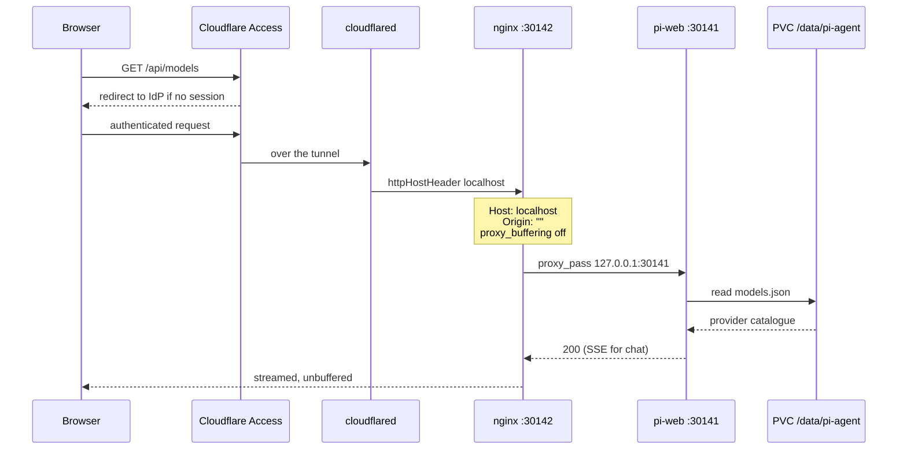
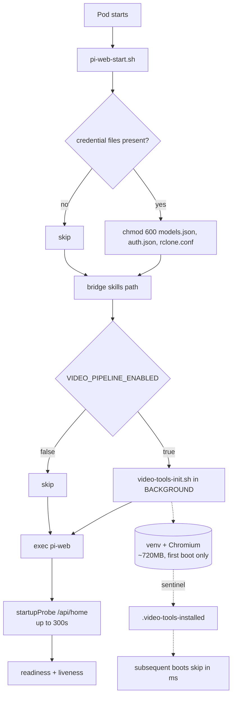

<p align="center">
  
</p>

<h1 align="center">Woow k3s Pi Agent Package</h1>

<p align="center">
  <strong>Self-hosted AI coding agent for Kubernetes — web UI, browser terminal, and a video pipeline in one pod</strong><br/>
  pi-web + pi coding agent + ttyd, delivered as a Helm chart with a locally-managed Cloudflare Tunnel
</p>

<p align="center">
  <a href="#overview">Overview</a> &bull;
  <a href="#features">Features</a> &bull;
  <a href="#architecture">Architecture</a> &bull;
  <a href="#components">Components</a> &bull;
  <a href="#screenshots">Screenshots</a> &bull;
  <a href="#installation">Installation</a> &bull;
  <a href="#configuration">Configuration</a> &bull;
  <a href="#security">Security</a> &bull;
  <a href="#testing">Testing</a> &bull;
  <a href="README_zh-TW.md">中文文件</a>
</p>

<p align="center">
  
  
  
  
  
</p>

---

## Overview

This package runs the [pi coding agent](https://www.npmjs.com/package/@earendil-works/pi-coding-agent) and its web UI, [pi-web](https://www.npmjs.com/package/@agegr/pi-web), on a k3s cluster. It is the Kubernetes sibling of [`Woow_ha_pi_agent_add_on`](https://github.com/WOOWTECH/Woow_ha_pi_agent_add_on), which packages the same stack as a Home Assistant Supervisor add-on.

Three surfaces share one pod and one volume: a chat UI, a browser terminal running the agent's own TUI, and a video-production toolchain the agent can drive through its bash tool. A change made in the terminal is a change to the instance the web UI serves — the same `models.json`, the same skills registry, the same session store.

### Why This Package?

| Challenge | Solution |
|---|---|
| The HA add-on is tied to a Supervisor that k3s does not have | Plain `debian:bookworm-slim` base; the kubelet is the supervisor, one process per container |
| `pi` is not on `PATH` in upstream's image — it ships only as a transitive dependency, so npm never links its bin | A launcher that resolves the nested CLI at runtime, plus a build assertion that fails the image if `pi --version` does not work |
| The browser terminal in earlier builds used `kubectl exec` into another pod, needing exec RBAC and breaking on every restart | ttyd runs as a sidecar on the same pod and the same PVC — no RBAC, no network hop, no race |
| Skills installed from the CLI never appeared in the web UI | A path bridge between `$PI_CODING_AGENT_DIR/skills` and `$HOME/.pi/agent/skills` |
| Tunnel routing lived in the Cloudflare dashboard, so a second team meant clicking through a UI | Locally-managed tunnel: hostname → service mapping is a chart template under version control |
| Any pod in the cluster could read the provider API key from an unauthenticated endpoint | A NetworkPolicy that admits only the tunnel pods and carves the cluster out of egress |
| CJK filenames containing U+3000 silently resolved to the wrong file | A build-time patch that demotes Unicode-space folding to a read-only fallback |

---

## Features

### Core Capabilities

- **Chat UI with real tool use** — the agent reads, writes, edits and runs shell commands against a persistent volume, streaming over SSE.
- **Skills** — drop a `SKILL.md` into the registry and it is injected into every session's system prompt. Discovery is live; no restart.
- **Browser terminal** — a full `pi` TUI over the web, on the same data directory as the UI. `pi config`, `pi auth`, `pi install` all operate on the instance the UI serves.
- **Provider-agnostic models** — configured in pi-web's own Models page and persisted to the volume. Any OpenAI-compatible or Anthropic-shaped endpoint; OpenRouter, LiteLLM, or a local vLLM service.
- **Video pipeline** — ffmpeg, Playwright-Chromium, edge-tts and rclone, bootstrapped onto the volume on first boot in the background so the chat UI is never blocked.
- **MCP over HTTP** — pi 0.83.0 has no native MCP client, but the agent performs the JSON-RPC/SSE handshake unaided through `bash` + `curl`. Verified against a live Odoo MCP server.

### Deployment Characteristics

- **One chart, one values file per team.** Namespace isolation; skills, sessions and credentials are per-instance.
- **Locally-managed Cloudflare Tunnel** with two hostnames — web UI and terminal — each gated by Cloudflare Access.
- **Everything baked into the image.** No runtime downloads of binaries; `ttyd` is checksum-verified at build time against the release's own `SHA256SUMS`.
- **Pinned dependencies.** `@agegr/pi-web` and `ttyd` are pinned build arguments, not floating tags.

---

## Architecture

### System Layout

```
                    Internet
                       │
                       ▼
        ┌────────────────────────────┐
        │   Cloudflare Access           │  email allow-list, 24h session
        │   pi-agent-woow.woowtech.io   │
        │   pi-agent-woow-tty…          │
        └──────────────┬───────────────┘
                       │  QUIC (tunnel 88f7b0ed…)
                       ▼
   ┌───────────────────────────────────────────────┐
   │ namespace: pi-agent-woow                       │
   │                                                │
   │  ┌────────────────────┐                        │
   │  │ cloudflared × 2    │  locally-managed config │
   │  │ podAntiAffinity    │  routing in the chart   │
   │  └─────────┬──────────┘                        │
   │            │  NetworkPolicy: only these pods    │
   │            ▼                                    │
   │  ┌───────────────────────────────────────────┐  │
   │  │ pod: pi-agent  (replicas 1, Recreate)    │  │
   │  │                                          │  │
   │  │  ┌────────┐   ┌─────────┐   ┌─────────┐ │  │
   │  │  │ nginx  │──►│ pi-web  │   │  ttyd   │ │  │
   │  │  │ :30142 │   │ :30141  │   │  :7681  │ │  │
   │  │  └────────┘   └────┬────┘   └────┬────┘ │  │
   │  │   Host/Origin      │             │      │  │
   │  │   rewrite          ▼             ▼      │  │
   │  │              ┌──────────────────────┐   │  │
   │  │              │  /data/pi-agent      │   │  │
   │  │              │  (PVC 20Gi, RWO)     │   │  │
   │  │              │  sessions/ skills/   │   │  │
   │  │              │  models.json  venv/  │   │  │
   │  │              │  playwright-cache/   │   │  │
   │  │              └──────────────────────┘   │  │
   │  └───────────────────────────────────────────┘  │
   │            │  egress: internet allowed,         │
   │            ▼  cluster CIDRs blocked             │
   └───────────────────────────────────────────────┘
              OpenRouter · GitHub · MCP endpoints
```

### Request Path — why nginx is not optional

pi-web's `isApiRequestAllowed()` rejects any request whose `Host` is not a loopback name or a raw IP, and any `Origin` that does not match. Traffic arrives carrying the public hostname, so without the sidecar's rewrite every auth-gated route answers `403 Untrusted API request` — the UI loads and then does nothing.



Two details in that diagram are load-bearing. `Origin: ""` is set only by nginx — the tunnel's `httpHostHeader` covers the `Host` half of the guard but not the `Origin` half. And `proxy_buffering off` is what lets a long chat response stream; with buffering on, generations truncate at the proxy and the UI simply stops mid-sentence.

### Storage and lifecycle



The video bootstrap is backgrounded rather than run as an initContainer. As a blocking init step, the first boot on a cold volume would leave the pod serving nothing for 10–20 minutes, and any hiccup in the download would produce a pod that never becomes ready. The HA add-on ran it as a dependency-free s6 oneshot for exactly this reason; the same semantics are preserved here.

### Why single replica

All state is files on one RWO volume — sessions, worktrees, `models.json`, the skills registry. Two replicas would double-write every one of them. `replicas: 1` with `strategy: Recreate` is a correctness constraint, not an untuned default.

---

## Components

### `Dockerfile` — the image

> Debian bookworm-slim, Node 22, no s6-overlay, no bashio.

- `pi` launcher on `PATH`, resolving the nested `@earendil-works/pi-coding-agent` CLI at runtime
- `ttyd` 1.7.7, downloaded and verified against the release `SHA256SUMS`
- Video toolchain: ffmpeg, `fonts-noto-cjk`, the Chromium runtime `.so` set, rclone
- Build assertions: `pi --version` must succeed, and the path patch must find at least two `path-utils.js` copies

**Image:** `ghcr.io/woowtech/woow-k3s-pi-agent` | **Arch:** amd64 (arm64 on tag pushes) | **Base:** `debian:bookworm-slim`

### `charts/pi-agent` — the Helm chart

> One chart, one values file per team. Renders 8 objects.

- `deployment.yaml` — three containers, `automountServiceAccountToken: false`, startup/readiness/liveness probes
- `configmap-nginx.yaml` — the Host/Origin rewrite and SSE settings
- `configmap-cloudflared.yaml` + `cloudflared.yaml` — locally-managed tunnel, 2 replicas, pod anti-affinity
- `networkpolicy.yaml` — ingress from the tunnel only; egress carves out the cluster
- `pvc.yaml` — 20Gi RWO with `helm.sh/resource-policy: keep`
- `secret.yaml` — ttyd credential, or `existingSecret`
- `tests/smoke.yaml` — `helm test` asserting pi-web answers 200 and ttyd answers 401

### `patches/fix-unicode-space-paths.mjs` — the CJK path fix

> Upstream folds U+3000 and other Unicode spaces to ASCII on every read, write and edit.

Reading `台灣　報告.txt` missed the real file; writes landed at a different path while reporting success against the original name; and with two files differing only by space type, reading one returned the other's contents with `isError: false`. The patch demotes folding to a read-only fallback and asserts every hunk, so an upstream bump fails the build rather than silently dropping the fix.

**Applies to:** 2 distinct upstream implementations (`pi-agent-core` harness tools, `pi-coding-agent` core tools)

### `rootfs/` — the scripts baked into the image

> In the image, not in ConfigMaps. A ConfigMap edit with no checksum annotation is inert until someone restarts the pod.

| Script | Role |
|---|---|
| `usr/local/bin/pi` | Launcher for the transitively-installed CLI |
| `usr/local/bin/pi-agent-env.sh` | One env definition, shared by pi-web, ttyd and the `pi` wrapper |
| `usr/local/bin/pi-web-start.sh` | pi-web entrypoint: file modes, skills bridge, TZ, video bootstrap |
| `usr/local/bin/video-tools-init.sh` | Idempotent, non-fatal, sentinel-guarded first-boot install |
| `usr/local/bin/ttyd-start.sh` | ttyd sidecar; refuses to start without `TTYD_PASSWORD` |
| `usr/local/bin/pi-shell.sh` | The shell ttyd forks per browser session |

### `deploy/rendered/` — CI-rendered manifests

> The chart is the single source of truth; CI renders it and commits the result.

Rendered with `ttyd.existingSecret` and `cloudflare.existingCredentialsSecret` so no credential ever reaches the rendered file, the CI log, or git history. A grep step fails the build if secret material appears.

---

## Screenshots

### Web UI — chat with the working directory bound

The session opens in a `pi-cwd-YYYYMMDD` directory on the persistent volume. The model selector, skills, plugins and file explorer are all reachable from this one screen.

<p align="center">
  
</p>

### Models — providers configured in the UI, persisted to the volume

Provider keys are entered here, not injected as environment variables. pi-web fetches the upstream catalogue and writes the selection to `models.json` on the PVC, so it survives a pod restart.

<p align="center">
  
</p>

### Skills — the registry the agent sees

Every `SKILL.md` under `/data/pi-agent/skills` is parsed and injected into the system prompt. Malformed skills are excluded with a diagnostic while the rest keep loading.

<p align="center">
  
</p>

### Plugins — packages installed from the terminal appear here

`pi install <github-url>` in the browser terminal registers a package in `settings.json`; the web UI reads the same file. This is the terminal/UI same-source-of-truth contract.

<p align="center">
  
</p>

### Browser terminal — `pi` on `PATH`, same volume as the UI

The banner names the data directory and the pinned versions. This is the capability that earlier builds lacked entirely: `pi` was command-not-found inside the container.

<p align="center">
  
</p>

### Browser terminal — the `pi config` TUI

Enabling and disabling package resources from the browser, against the same instance the web UI serves.

<p align="center">
  
</p>

---

## Installation

### Prerequisites

- **k3s or Kubernetes 1.28+** with a CNI that enforces NetworkPolicy
- **Helm 3.16+**
- **A ReadWriteOnce StorageClass** that is node-portable — the pod gets rescheduled, and a node-local volume strands its state
- **A Cloudflare account** with a zone, if using the bundled tunnel
- **An LLM provider API key** — entered in the UI after deployment, not at install time

### Step 1: Create the Cloudflare tunnel

```bash
# Creates a locally-managed tunnel and writes credentials.json
cloudflared tunnel create pi-agent-<team>

# Point both hostnames at it
cloudflared tunnel route dns pi-agent-<team> pi-agent-<team>.example.com
cloudflared tunnel route dns pi-agent-<team> pi-agent-<team>-tty.example.com
```

Note the tunnel UUID — it goes into `cloudflare.tunnelId`.

### Step 2: Create the namespace and secrets

```bash
kubectl create namespace pi-agent-<team>

# The browser terminal is a root shell. Generate, do not choose.
kubectl -n pi-agent-<team> create secret generic pi-agent-ttyd \
  --from-literal=TTYD_PASSWORD="$(openssl rand -base64 18)"

kubectl -n pi-agent-<team> create secret generic pi-agent-cf-creds \
  --from-file=credentials.json=./tunnel-credentials.json
```

### Step 3: Install the chart

```bash
helm upgrade --install pi-agent ./charts/pi-agent \
  --namespace pi-agent-<team> \
  -f values-woow.yaml \
  --set cloudflare.tunnelId=<tunnel-uuid> \
  --set cloudflare.hostnames.web=pi-agent-<team>.example.com \
  --set cloudflare.hostnames.terminal=pi-agent-<team>-tty.example.com \
  --set ttyd.existingSecret=pi-agent-ttyd \
  --set cloudflare.existingCredentialsSecret=pi-agent-cf-creds

helm test pi-agent -n pi-agent-<team>
```

The first boot downloads roughly 720 MB of Python venv and Chromium in the background. The chat UI is usable throughout; only the video pipeline waits.

### Step 4: Gate both hostnames with Cloudflare Access

1. Open **Cloudflare Zero Trust > Access > Applications**
2. Add a **Self-hosted** application for each hostname
3. Attach an **allow** policy with an email allow-list or your IdP group
4. Do **not** attach an IP-bypass policy to the terminal hostname — it is a root shell

---

## Configuration

### 1. Provider setup

Navigate to **Models** in the web UI. Add a provider, paste the API key, and pick the models to expose. pi-web writes the result to `/data/pi-agent/models.json` on the volume.

Prefer `modelOverrides{}` over a bare `models[]` entry: a `models[]` entry fully replaces the upstream catalogue entry, which silently zeroes the cost fields and truncates the context window to defaults.

### 2. Skills

```bash
# From the browser terminal, or any shell on the volume
mkdir -p /data/pi-agent/skills/my-skill
cat > /data/pi-agent/skills/my-skill/SKILL.md <<'EOF'
---
name: my-skill
description: Use when the user asks to do X. Write this imperatively — it is the exact string the model sees.
---

# Procedure
1. ...
EOF
```

Discovery is live. The `description` is what drives triggering; a description containing common vocabulary will over-trigger.

### 3. Chart values worth knowing

| Value | Default | Notes |
|---|---|---|
| `networkPolicy.enabled` | `true` | Blocks cluster-internal reach; leave on |
| `networkPolicy.blockedCIDRs` | pod, service, node, metadata | Adjust to your cluster's CIDRs |
| `videoPipeline.enabled` | `true` | ~720 MB first-boot download, backgrounded |
| `videoPipeline.reset` | `false` | One-shot: clears venv and Chromium, then set back |
| `persistence.storageClassName` | `nfs-data` | Must be node-portable |
| `ttyd.existingSecret` | `""` | Preferred over `ttyd.password` — keeps the credential out of rendered manifests |
| `cloudflare.replicas` | `2` | A single tunnel pod is an SPOF for both hostnames |
| `podSecurityContext.runAsUser` | `0` | See Security — running non-root needs a chown pass over existing volumes |

---

## Security

### What this deployment does enforce

| Control | Status |
|---|---|
| Cloudflare Access on both hostnames | Enforced, email allow-list, no IP bypass on the terminal |
| ttyd basic auth | Enforced; the container refuses to start with an empty password |
| NetworkPolicy ingress | Only the tunnel pods reach the app; direct pod-IP access is blocked |
| NetworkPolicy egress | Internet allowed; Kubernetes API, service CIDR, pod CIDR and node network blocked |
| ServiceAccount token | Not mounted (`automountServiceAccountToken: false`) |
| Credential file modes | `0600` on every boot |
| Worktree boundary | The REST file/git surface enforces a lexical **and** realpath check against the allowed roots |

### What it does not

These are upstream properties of the agent, not configuration mistakes, and they are the reason this package is **not yet suitable for untrusted or multi-tenant use**:

- **No sandbox and no approval gate.** `read`, `write`, `edit` and `bash` accept any absolute path in the container. There is no `permissionMode`, no `canUseTool` hook, and no approval event anywhere in `@earendil-works/pi-coding-agent`. A session can rewrite the shared skills registry, which is injected into every future session's system prompt.
- **The agent runs as root.** Changing this requires a chown pass over existing volumes; it is a tracked follow-up, not a values flip.
- **`GET /api/models-config` returns the provider API key unredacted and unauthenticated.** The NetworkPolicy closes the in-cluster path; any user who passes Cloudflare Access can still read it, and so can the agent's own `read` tool.
- **The chart ships no authentication of its own.** pi-web logs `listening on 0.0.0.0 without authentication` on every boot. Access-equivalent gating is a hard prerequisite, not an option.
- **Prompt-injection resistance is model behaviour, not an enforced control.** It held in testing; it must not be sold as a guarantee.

Treat this as a **single-tenant tool for a trusted team**, behind SSO, until those are addressed.

---

## Testing

A ten-dimension review drove real conversations through the web UI — not API assertions — and every reported failure above medium severity was independently re-verified by a separate reviewer whose default assumption was that the report was wrong.

| Dimension | Result |
|---|---|
| Skills | Positive triggering, five-prompt negative control, disambiguation with a decoy, helper-script execution, malformed-skill graceful degradation — all pass on both models |
| Sessions | Multi-turn continuity, resume-from-disk after eviction, valid JSONL, two concurrent sessions isolated, HTML export |
| Git & worktrees | Conversational git matched ground truth byte-for-byte; the allowed-root boundary held against `..`, symlink escape and a session-ID bypass |
| Robustness | `restartCount: 0` across ~20 conversations; RSS flat; 4-way concurrency at 1.46× latency; abort stops an LLM stream in 3 ms |
| Documents | Zero fabricated documents in 8 runs, including adversarial prompts |
| MCP over HTTP | Handshake discovered unaided; no hallucinated data on auth failure; answers matched ground truth exactly |
| Models | Both models complete tool-using turns; mid-session switch proven in raw SSE attribution |
| Files | 50 KB / 2000-line truncation never splits a line; 8.9 MB handled |
| Security | **3 blockers confirmed** — no path confinement, unrestricted cluster egress (now fixed), no approval gate |
| Document formats | CSV, JSON, Markdown, HTML native; XLSX/DOCX/PDF need packages baked in |

Full report: [`docs/READINESS.md`](docs/READINESS.md).

---

## Known Limitations

- **Single-tenant per pod.** One root home, one shared skills registry, one credential, one session store.
- **No native MCP client.** The agent acts as one over `bash` + `curl`; retry loops are unbounded.
- **Text-only unless a vision model is configured.** Scanned invoices and screenshots cannot be read by the default DeepSeek models.
- **Four tools only** — `read`, `write`, `edit`, `bash`. Every listing and search runs as a shell command.
- **300 s request ceiling.** Long conversions terminate without a final answer.
- **No plugin hot-reload in an open chat.** Extension source edits require a pod restart.
- **Session storage grows unbounded.** No retention job, no pagination on `/api/sessions`.
- **The 20Gi PVC is advisory** on an NFS subdir provisioner, not enforced.

---

## Changelog

### v0.1.0 (2026-08)

- Initial k3s package: image, Helm chart, locally-managed Cloudflare Tunnel, CI build and chart render
- `pi` launcher and build-time assertion — the browser terminal can drive the agent TUI for the first time
- ttyd as a same-pod sidecar, replacing the `kubectl exec` terminal and its exec RBAC
- Skills path bridge between the CLI's write location and pi-web's read location
- Video bootstrap backgrounded rather than blocking startup
- NetworkPolicy on by default; ingress restricted to the tunnel, cluster CIDRs carved out of egress
- Build-time patch for silent CJK path corruption
- Credential files forced to `0600` on every boot

---

## Support

- **Issues:** [GitHub Issues](https://github.com/WOOWTECH/Woow_k3s_pi_agent_package/issues)
- **Upstream add-on:** [Woow_ha_pi_agent_add_on](https://github.com/WOOWTECH/Woow_ha_pi_agent_add_on)
- **Email:** woowtech@designsmart.com.tw

---

## License

This project is licensed under the **MIT License**, matching the upstream add-on.

Bundled software keeps its own licence: `@agegr/pi-web`, `@earendil-works/pi-coding-agent`, `ttyd`, `cloudflared`, `ffmpeg` and `rclone` are each governed by their upstream terms.

---

<p align="center">
  <sub>Built by <a href="https://github.com/WOOWTECH">WOOWTECH</a> &bull; Powered by k3s</sub>
</p>
