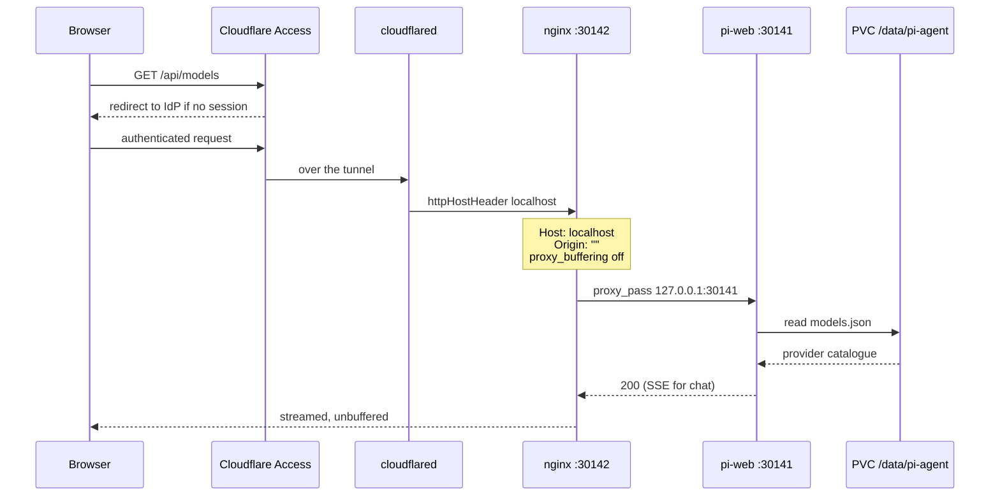
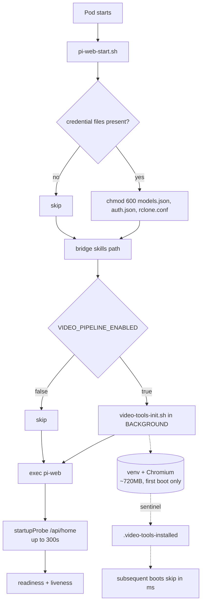

<p align="center">
  
</p>

<h1 align="center">Woow k3s Pi Agent 套件</h1>

<p align="center">
  <strong>Kubernetes 上的自架 AI 編碼代理 — 網頁介面、瀏覽器終端與影片產製流程，同在一個 Pod 內</strong><br/>
  pi-web + pi coding agent + ttyd，以 Helm chart 交付，搭配本地管理的 Cloudflare Tunnel
</p>

<p align="center">
  <a href="#概述">概述</a> &bull;
  <a href="#功能特色">功能特色</a> &bull;
  <a href="#系統架構">系統架構</a> &bull;
  <a href="#元件說明">元件說明</a> &bull;
  <a href="#操作介面">操作介面</a> &bull;
  <a href="#安裝說明">安裝說明</a> &bull;
  <a href="#設定指南">設定指南</a> &bull;
  <a href="#安全機制">安全機制</a> &bull;
  <a href="#測試報告">測試報告</a> &bull;
  <a href="README.md">English</a>
</p>

<p align="center">
  
  
  
  
  
</p>

---

## 概述

本套件在 k3s 叢集上執行 [pi coding agent](https://www.npmjs.com/package/@earendil-works/pi-coding-agent) 以及它的網頁介面 [pi-web](https://www.npmjs.com/package/@agegr/pi-web)。它是 [`Woow_ha_pi_agent_add_on`](https://github.com/WOOWTECH/Woow_ha_pi_agent_add_on) 的 Kubernetes 版本 — 後者把同一套堆疊包裝成 Home Assistant Supervisor 附加元件。

三個操作介面共用同一個 Pod、同一個磁碟區：對話介面、執行代理自身 TUI 的瀏覽器終端，以及代理可透過 bash 工具驅動的影片產製工具鏈。在終端裡做的變更，就是對網頁介面所服務的那個執行個體做的變更 — 同一份 `models.json`、同一份技能登錄、同一份 session 儲存區。

### 為什麼需要這個套件？

| 挑戰 | 解法 |
|---|---|
| HA 附加元件綁定在 Supervisor 上，而 k3s 沒有 Supervisor | 改用單純的 `debian:bookworm-slim` 基底；kubelet 就是那個 supervisor，一個容器跑一個程序 |
| 上游映像檔的 `PATH` 上找不到 `pi` — 它只以間接相依套件的形式出貨，npm 從不為它連結 bin | 用一支啟動器在執行期解析巢狀的 CLI，再加上建置期斷言：只要 `pi --version` 不能動，映像檔就建置失敗 |
| 早期版本的瀏覽器終端靠 `kubectl exec` 進入另一個 Pod，需要 exec RBAC，而且每次重啟都會斷 | ttyd 以 sidecar 形式跑在同一個 Pod、同一個 PVC 上 — 不用 RBAC、不跨網路、沒有競爭條件 |
| 從 CLI 安裝的技能從來不會出現在網頁介面 | 在 `$PI_CODING_AGENT_DIR/skills` 與 `$HOME/.pi/agent/skills` 之間建立路徑橋接 |
| Tunnel 路由設定放在 Cloudflare 儀表板，多開一個團隊就得在介面上一路點擊 | 本地管理的 tunnel：主機名稱 → 服務的對應是納入版本控管的 chart 模板 |
| 叢集內任何 Pod 都能從未認證的端點讀到供應商 API 金鑰 | NetworkPolicy 只放行 tunnel Pod，並把叢集網段從 egress 中排除 |
| 含 U+3000 的 CJK 檔名會靜默解析到錯誤的檔案 | 建置期修補程式，把 Unicode 空白折疊降級為唯讀的後備行為 |

---

## 功能特色

### 核心能力

- **具備真實工具使用能力的對話介面** — 代理會對持久磁碟區進行讀取、寫入、編輯與執行 shell 指令，並以 SSE 串流輸出。
- **技能（Skills）** — 把一份 `SKILL.md` 丟進登錄目錄，它就會被注入每一個 session 的系統提示詞。探索是即時的，不需重啟。
- **瀏覽器終端** — 在網頁上取得完整的 `pi` TUI，與網頁介面使用同一個資料目錄。`pi config`、`pi auth`、`pi install` 全都作用在網頁介面所服務的那個執行個體上。
- **供應商中立的模型設定** — 在 pi-web 自己的 Models 頁面設定並持久化到磁碟區。任何 OpenAI 相容或 Anthropic 形式的端點皆可；OpenRouter、LiteLLM，或本地的 vLLM 服務都行。
- **影片產製流程** — ffmpeg、Playwright-Chromium、edge-tts 與 rclone，在首次開機時於背景引導安裝到磁碟區，對話介面因此不會被卡住。
- **透過 HTTP 使用 MCP** — pi 0.83.0 沒有原生 MCP 用戶端，但代理能單靠 `bash` + `curl` 自行完成 JSON-RPC/SSE 交握。已對正式運作中的 Odoo MCP 伺服器驗證過。

### 部署特性

- **一份 chart，每個團隊一份 values 檔。** namespace 層級隔離；技能、session 與憑證都是各執行個體獨立的。
- **本地管理的 Cloudflare Tunnel**，兩個主機名稱 — 網頁介面與終端 — 各自由 Cloudflare Access 把關。
- **一切都烘進映像檔。** 執行期不下載任何二進位檔；`ttyd` 在建置期會對照該發行版自帶的 `SHA256SUMS` 驗證校驗碼。
- **相依版本全部釘死。** `@agegr/pi-web` 與 `ttyd` 是固定的建置參數，不是浮動標籤。

---

## 系統架構

### 系統佈局

```
                    Internet
                       │
                       ▼
        ┌─────────────────────────────┐
        │ Cloudflare Access           │  email allow-list, 24h session
        │ pi-agent-woow.woowtech.io   │
        │ pi-agent-woow-tty…          │
        └──────────────┬──────────────┘
                       │  QUIC (tunnel 88f7b0ed…)
                       ▼
   ┌─────────────────────────────────────────────────┐
   │ namespace: pi-agent-woow                        │
   │                                                 │
   │  ┌────────────────────┐                         │
   │  │ cloudflared × 2    │  locally-managed config │
   │  │ podAntiAffinity    │  routing in the chart   │
   │  └─────────┬──────────┘                         │
   │            │  NetworkPolicy: only these pods    │
   │            ▼                                    │
   │  ┌───────────────────────────────────────────┐  │
   │  │ pod: pi-agent  (replicas 1, Recreate)     │  │
   │  │                                           │  │
   │  │  ┌────────┐   ┌─────────┐   ┌─────────┐   │  │
   │  │  │ nginx  │──►│ pi-web  │   │  ttyd   │   │  │
   │  │  │ :30142 │   │ :30141  │   │  :7681  │   │  │
   │  │  └────────┘   └────┬────┘   └────┬────┘   │  │
   │  │   Host/Origin      │             │        │  │
   │  │   rewrite          ▼             ▼        │  │
   │  │              ┌──────────────────────┐     │  │
   │  │              │  /data/pi-agent      │     │  │
   │  │              │  (PVC 20Gi, RWO)     │     │  │
   │  │              │  sessions/ skills/   │     │  │
   │  │              │  models.json  venv/  │     │  │
   │  │              │  playwright-cache/   │     │  │
   │  │              └──────────────────────┘     │  │
   │  └───────────────────────────────────────────┘  │
   │            │  egress: internet allowed,         │
   │            ▼  cluster CIDRs blocked             │
   └─────────────────────────────────────────────────┘
              OpenRouter · GitHub · MCP endpoints
```

### 請求路徑 — 為什麼 nginx 不可省略

pi-web 的 `isApiRequestAllowed()` 會拒絕任何 `Host` 不是 loopback 名稱或裸 IP 的請求，也會拒絕任何不相符的 `Origin`。流量抵達時帶的是對外的公開主機名稱，因此少了 sidecar 的改寫，每一條需要認證的路由都會回 `403 Untrusted API request` — 介面載入得起來，然後什麼都做不了。



這張圖裡有兩個細節是關鍵，不可省略。`Origin: ""` 只有 nginx 會設定 — tunnel 的 `httpHostHeader` 只覆蓋了防護機制中 `Host` 的那一半，`Origin` 那一半沒有。另一個是 `proxy_buffering off`，它才是讓長篇對話回應能夠串流的原因；一旦開啟緩衝，生成內容會在代理層被截斷，介面就這麼在句子中間停住。

### 儲存與生命週期



影片工具的引導安裝是丟到背景執行，而不是做成 initContainer。若當成阻塞式的初始化步驟，在冷磁碟區上的第一次開機會讓 Pod 有 10 到 20 分鐘完全無法提供服務，而下載過程中任何一點閃失都會產生一個永遠無法就緒的 Pod。HA 附加元件正是基於同樣的理由，把它跑成一個不帶相依的 s6 oneshot；這裡保留了相同的語意。

### 為什麼只有單一副本

所有狀態都是單一 RWO 磁碟區上的檔案 — session、worktree、`models.json`、技能登錄。兩個副本會把上述每一項都重複寫入。`replicas: 1` 搭配 `strategy: Recreate` 是正確性上的限制，不是沒調過的預設值。

---

## 元件說明

### `Dockerfile` — 映像檔

> Debian bookworm-slim、Node 22，不用 s6-overlay，不用 bashio。

- `pi` 啟動器放在 `PATH` 上，在執行期解析巢狀的 `@earendil-works/pi-coding-agent` CLI
- `ttyd` 1.7.7，下載後對照發行版的 `SHA256SUMS` 驗證
- 影片工具鏈：ffmpeg、`fonts-noto-cjk`、Chromium 執行期所需的 `.so` 集合、rclone
- 建置期斷言：`pi --version` 必須成功，且路徑修補程式必須至少找到兩份 `path-utils.js`

**映像檔：** `ghcr.io/woowtech/woow-k3s-pi-agent` | **架構：** amd64（推送標籤時另出 arm64） | **基底：** `debian:bookworm-slim`

### `charts/pi-agent` — Helm chart

> 一份 chart，每個 release 一份 values 檔。agent release 預設渲染 5 個物件；只跑 tunnel 的 release 渲染 3 個。

- `deployment.yaml` — pi-web 加 nginx sidecar（若重新啟用還有 ttyd）、`automountServiceAccountToken: false`、startup/readiness/liveness 探針
- `configmap-nginx.yaml` — Host/Origin 改寫與 SSE 設定
- `configmap-omnigent-patch.yaml` — Omnigent 模型選單修補，掛給 postStart hook 使用
- `configmap-cloudflared.yaml` + `cloudflared.yaml` — 本地管理的 tunnel、2 個副本、Pod 反親和性
- `networkpolicy.yaml` — ingress 只允許 tunnel（或擋在前面的代理）；egress 排除叢集網段
- `pvc.yaml` — RWO，預設 `longhorn`，uninstall 時保留
- `secret.yaml` — ttyd 憑證，或改用 `existingSecret`
- `tests/smoke.yaml` — `helm test`：pi-web 經 nginx 回 200（啟用 ttyd 時再斷言 ttyd 回 401）。唯讀、會重試，而且只跑 tunnel 的 release 不會渲染它
- `NOTES.txt` — 接下來該執行什麼，以及這個 release 是否會保留資料

兩個開關決定一個 release 的身分：

| 值 | 渲染內容 |
|---|---|
| `agent.enabled=true`、`cloudflare.enabled=false`（預設） | 只有 agent — 對外入口由獨立的 tunnel release 提供 |
| `agent.enabled=false`、`cloudflare.enabled=true` | 只跑 tunnel 的 release：cloudflared、它的設定與憑證 |
| 兩者皆 `true` | 一個 release 同時擁有兩者，也就是原本的單團隊拓撲 |

`keepOnUninstall`（預設 `true`）會在資料 PVC 以及 chart 建立的每一個 Secret 上加 `helm.sh/resource-policy: keep`，所以 `helm uninstall` 不會是「一個月的 session 消失」或「本地管理 tunnel 的唯一一份憑證消失」的原因。chart 從不渲染 Namespace：Helm 的 release 記錄就放在那裡，所以由 `--create-namespace` 負責建立。

### `patches/fix-unicode-space-paths.mjs` — CJK 路徑修正

> 上游會在每一次讀取、寫入與編輯時，把 U+3000 及其他 Unicode 空白折疊成 ASCII 空白。

讀取 `台灣　報告.txt` 會找不到真正的檔案；寫入會落在另一個路徑，卻回報對原檔名操作成功；而當兩個檔案只差在空白字元種類時，讀取其中一個會回傳另一個的內容，並且 `isError: false`。這份修補程式把折疊行為降級成唯讀的後備方案，並對每一個修補區塊做斷言，因此上游一旦升版而修補失效，會直接讓建置失敗，而不是靜悄悄地把修正弄丟。

**套用範圍：** 2 份彼此獨立的上游實作（`pi-agent-core` harness 工具、`pi-coding-agent` core 工具）

### `rootfs/` — 烘進映像檔的腳本

> 放在映像檔裡，不放在 ConfigMap 裡。沒有 checksum annotation 的 ConfigMap 改動，在有人重啟 Pod 之前都是無效的。

| 腳本 | 職責 |
|---|---|
| `usr/local/bin/pi` | 間接安裝的 CLI 的啟動器 |
| `usr/local/bin/pi-agent-env.sh` | 單一份環境變數定義，由 pi-web、ttyd 與 `pi` 包裝器共用 |
| `usr/local/bin/pi-web-start.sh` | pi-web 進入點：檔案權限、技能路徑橋接、時區、影片工具引導 |
| `usr/local/bin/video-tools-init.sh` | 冪等、非致命、以哨兵檔把關的首次開機安裝 |
| `usr/local/bin/ttyd-start.sh` | ttyd sidecar；沒有 `TTYD_PASSWORD` 就拒絕啟動 |
| `usr/local/bin/pi-shell.sh` | ttyd 為每個瀏覽器 session fork 出來的 shell |

### `charts/pi-agent/values/woow-k3s/` — 實機各 release 的 values

> 每個實機 release 一份檔案，這樣重建叢集靠的是這個 repo，而不是 `helm get values`。

| 檔案 | Release | 特別之處 |
|---|---|---|
| `pi-agent.yaml` | `pi-agent` | 51Gi 磁碟區（手動擴容過，絕對不可縮小）、`NODE_OPTIONS=--max-old-space-size=12288`、Omnigent 開啟。沒有 `fullnameOverride`：它的 release 名稱剛好等於 chart 名稱 |
| `pi-agent-2.yaml`、`pi-agent-3.yaml` | `pi-agent-2/-3` | 20Gi、12288MB heap、Omnigent 關閉 |
| `pi-agent-4.yaml`、`pi-agent-5.yaml` | `pi-agent-4/-5` | 20Gi、6144MB heap、Omnigent 開啟 |
| `pi-tunnel.yaml` | `pi-tunnel` | 只跑 tunnel 的 release：`agent.enabled=false`，以及完整的七條路由表，其中兩條其實屬於別的東西（opendesign、NPM 管理介面） |

**這些檔案刻意不含任何憑證。** `pi-tunnel` 的實機 release 是把 tunnel 憑證直接寫在 values 裡，所以升級時必須再餵一次：

```bash
umask 077
helm --kube-context woow-k3s get values pi-tunnel -n pi-agent-woow -o json \
  | jq -r .cloudflare.credentialsJson > /secure/tunnel-credentials.json
```

`scripts/check-drift.sh` 會把每一份 values 渲染出來與實機 release 比對，同時報告物件層級的差異與 pod template 的差異 — 後者才是「升級會不會重啟東西」的答案：

```bash
CONTEXT=woow-k3s NAMESPACE=pi-agent-woow scripts/check-drift.sh
```

### `deploy/npm/` — Nginx Proxy Manager，刻意不放進 chart

NPM 為五台 agent 中的四台提供 Basic Auth，部署方式是 `kubectl apply -f deploy/npm/npm.yaml`。這是擁有者的決定，不是漏掉：把它併進某個 chart release，等於讓所有 agent 的閘門跟其中一台的 `helm upgrade` 綁在一起。chart 的 `networkPolicy.extraCloudflaredApps: [npm]` 才是放行它流量的地方。

---

## 操作介面

本節以文字說明每個操作介面的行為，而不是以截圖呈現 — 螢幕擷取畫面並未納入版本庫。前四項是網頁介面中的面板，後兩項是瀏覽器終端。

### 網頁介面 — 對話，並綁定工作目錄

session 會在持久磁碟區上的 `pi-cwd-YYYYMMDD` 目錄中開啟。模型選擇器、技能、外掛與檔案瀏覽器都能從這一個畫面抵達。

### 模型 — 在介面中設定供應商，持久化到磁碟區

供應商金鑰是在 Models 頁面輸入，而不是以環境變數注入。pi-web 會抓取上游型錄，並把選擇結果寫入 PVC 上的 `models.json`，因此可以撐過 Pod 重啟。

### 技能 — 代理實際看到的登錄

`/data/pi-agent/skills` 底下每一份 `SKILL.md` 都會被解析並注入系統提示詞。格式有誤的技能會被排除並附上診斷訊息，其餘的照常載入。

### 外掛 — 從終端安裝的套件會出現在網頁介面

在瀏覽器終端執行 `pi install <github-url>` 會把套件登記到 `settings.json`；網頁介面讀的是同一個檔案。這就是終端與介面之間「同一事實來源」的契約。

### 瀏覽器終端 — `pi` 就在 `PATH` 上，與介面共用同一個磁碟區

終端開啟時會顯示一段橫幅，標示資料目錄與釘死的版本號。這正是早期版本完全缺席的能力：當時在容器內執行 `pi` 只會得到 command-not-found。

### 瀏覽器終端 — `pi config` TUI

這個 TUI 可直接從瀏覽器啟用或停用套件資源，作用對象就是網頁介面所服務的那個執行個體。

---

## 安裝說明

### 前置需求

- **k3s 或 Kubernetes 1.28+**，且 CNI 必須真正強制執行 NetworkPolicy
- **Helm 3.16+**
- **一個可跨節點搬移的 ReadWriteOnce StorageClass** — Pod 會被重新排程，而節點本地的磁碟區會把狀態困在原節點
- **一個 Cloudflare 帳號**與一個 zone，若要使用內附的 tunnel
- **一組 LLM 供應商 API 金鑰** — 在部署完成後於介面中輸入，安裝時不需要

### 步驟一：建立 Cloudflare tunnel

```bash
# Creates a locally-managed tunnel and writes credentials.json
cloudflared tunnel create pi-agent-<team>

# Point the hostname at it
cloudflared tunnel route dns pi-agent-<team> pi-agent-<team>.example.com
```

記下 tunnel UUID — 它要填進 `cloudflare.tunnelId`。`credentials.json` 請放在 repo 外面：它沒辦法再從 Cloudflare 下載一次。

### 步驟二：建立 namespace 與 tunnel Secret

```bash
kubectl create namespace pi-agent-<team>

# 比用 Helm value 傳憑證更好：這樣它不會落進任何一版 release 記錄。
# 每個 key 的說明見 examples/secrets.example.yaml。
kubectl -n pi-agent-<team> create secret generic pi-agent-cf-creds \
  --from-file=credentials.json=./tunnel-credentials.json
kubectl -n pi-agent-<team> annotate secret pi-agent-cf-creds helm.sh/resource-policy=keep
```

### 步驟三：安裝 agent

從 clone 安裝：

```bash
helm upgrade --install pi-agent ./charts/pi-agent \
  --namespace pi-agent-<team> \
  --set persistence.storageClassName=longhorn \
  --set persistence.size=20Gi
```

或者不 clone，直接從 GitHub 安裝：

```bash
helm upgrade --install pi-agent \
  https://github.com/WOOWTECH/Woow_k3s_pi_agent_package/archive/refs/heads/main.tar.gz \
  --namespace pi-agent-<team> \
  --set persistence.storageClassName=longhorn
```

若要重建 WoowTech 既有的某個 release，改帶它的 instance values：

```bash
helm upgrade --install pi-agent-4 ./charts/pi-agent -n pi-agent-woow \
  -f charts/pi-agent/values/woow-k3s/pi-agent-4.yaml
```

首次開機會在背景下載大約 720 MB 的 Python venv 與 Chromium。整個過程中對話介面都可以使用，只有影片產製流程需要等待。

### 步驟四：把 tunnel 裝成獨立的 release

tunnel 刻意**不**屬於任何 agent release：一個 cloudflared 擋在所有 agent 前面，而升級其中一台 agent 不該有能力動到它。

```bash
helm upgrade --install pi-tunnel ./charts/pi-agent \
  --namespace pi-agent-<team> \
  --set agent.enabled=false \
  --set fullnameOverride=pi-tunnel \
  --set cloudflare.enabled=true \
  --set cloudflare.tunnelId=<tunnel-uuid> \
  --set cloudflare.existingCredentialsSecret=pi-agent-cf-creds \
  --set-json 'cloudflare.extraIngress=[{"hostname":"pi-agent-<team>.example.com","service":"http://pi-agent.pi-agent-<team>.svc.cluster.local:30142","originRequest":{"connectTimeout":"30s","httpHostHeader":"localhost"}}]'
```

接著告訴 agent 哪個 tunnel 可以連它 — tunnel 一旦搬走，chart 依 release 名稱產生的那條 selector 就誰也對不上：

```bash
helm upgrade pi-agent ./charts/pi-agent -n pi-agent-<team> --reuse-values \
  --set 'networkPolicy.extraCloudflaredApps[0]=pi-tunnel-cloudflared'
```

### 步驟五：驗證

```bash
kubectl -n pi-agent-<team> rollout status deploy/pi-agent --timeout=10m
helm test pi-agent -n pi-agent-<team> --logs
```

smoke test 是唯讀的：它經 nginx sidecar 向 pi-web 要 `/api/home`，預期 200。它最多重試 150 秒，因為 k3s 的 NetworkPolicy 實作需要幾秒鐘才會放行一個剛建立的 Pod。

> 在 `networkPolicy.enabled=true` 的情況下，`helm test` 需要 `networkPolicy.allowHelmTest=true`（chart 預設值）。這個值在 `values/woow-k3s/*.yaml` 裡是**關閉**的 — 原因見「已知限制」。

### 步驟六：以 Cloudflare Access 保護每個主機名稱

1. 開啟 **Cloudflare Zero Trust > Access > Applications**
2. 為每個主機名稱各新增一個 **Self-hosted** 應用程式
3. 掛上一條 **allow** 政策，使用電子郵件白名單或你的 IdP 群組
4. **不要**掛 IP-bypass 政策 — agent 本身是一個沒有任何認證的 root shell

### 卸載 — 資料會留下

```bash
helm uninstall pi-agent -n pi-agent-<team>
```

Deployment、Service、ConfigMap 與 NetworkPolicy 會消失。PVC 與 chart 建立的每一個 Secret 都會留下，因為 `keepOnUninstall` 是 `true`；之後用同樣名稱 `helm install` 會把它們接回來。刪掉資料是另一件必須刻意去做的事：

```bash
kubectl -n pi-agent-<team> delete pvc pi-agent-data   # 不可逆
```

### 接管既有 release，或搬移 release

woow-k3s 上這六個 release 都已經由 Helm 管理，所以接管就只是帶著正確 values 的 `helm upgrade` — 而且它應該什麼都不會重啟。執行之前先證明這件事：

```bash
CONTEXT=woow-k3s NAMESPACE=pi-agent-woow scripts/check-drift.sh   # 離開碼 0 = 沒有漂移
```

如果某個 release 是要從 `kubectl` 管理的物件接手，升級時再加上 `--take-ownership`。有兩件事即使功能沒變也會讓 Pod 重啟，請先確認：

- **chart 版本。** `helm.sh/chart` 在這裡是 pod template 的標籤，而 nginx／cloudflared 兩個 ConfigMap 也帶著它，所以它們的 `checksum/*` annotation 會跟著動。停在舊 chart 版本的 release，升到目前版本**一定**會重啟。
- **`persistence.size`。** 只能變大。values 裡的數字比實機 PVC 小，升級會直接失敗。

---

## 設定指南

### 1. 供應商設定

在網頁介面中前往 **Models**。新增供應商、貼上 API 金鑰，並挑選要開放的模型。pi-web 會把結果寫入磁碟區上的 `/data/pi-agent/models.json`。

請優先使用 `modelOverrides{}` 而不是直接寫一筆 `models[]`：一筆 `models[]` 項目會完全取代上游型錄中的對應項目，這會靜默地把成本欄位歸零，並把上下文視窗截短成預設值。

### 2. 技能

```bash
# From the browser terminal, or any shell on the volume
mkdir -p /data/pi-agent/skills/my-skill
cat > /data/pi-agent/skills/my-skill/SKILL.md <<'EOF'
---
name: my-skill
description: Use when the user asks to do X. Write this imperatively — it is the exact string the model sees.
---

# Procedure
1. ...
EOF
```

探索是即時的。真正決定觸發時機的是 `description`；描述中若含有太過通用的詞彙，會導致過度觸發。

### 3. 值得知道的 chart values

| 設定值 | 預設 | 說明 |
|---|---|---|
| `networkPolicy.enabled` | `true` | 阻擋叢集內部橫向存取；請保持開啟 |
| `networkPolicy.blockedCIDRs` | pod、service、node、metadata | 請依你的叢集網段調整 |
| `videoPipeline.enabled` | `true` | 首次開機約 720 MB 下載，於背景執行 |
| `videoPipeline.reset` | `false` | 一次性操作：清掉 venv 與 Chromium，之後請改回 |
| `persistence.storageClassName` | `longhorn` | 必須可跨節點搬移。`nfs-data` 在 woow-k3s 根本不存在，只會讓 PVC 卡在 Pending |
| `persistence.size` | `20Gi` | 只能變大 — 比實機 PVC 小就會讓升級失敗 |
| `keepOnUninstall` | `true` | uninstall 時保留 PVC 與 chart 建立的 Secret |
| `agent.enabled` | `true` | 設 `false` 會渲染成只跑 tunnel 的 release |
| `cloudflare.enabled` | `false` | tunnel 應該自己一個 release |
| `networkPolicy.allowHelmTest` | `true` | 讓 smoke Pod 穿過 policy；實機的 instance values 是關閉的 |
| `ttyd.existingSecret` | `""` | 優先於 `ttyd.password` — 可讓憑證不出現在渲染後的 manifest 中 |
| `cloudflare.replicas` | `2` | 單一 tunnel Pod 會成為兩個主機名稱共同的單點故障 |
| `podSecurityContext.runAsUser` | `0` | 參見安全機制 — 改用非 root 需要對既有磁碟區做一次 chown |

---

## 安全機制

### 這套部署確實有強制執行的項目

| 控制項 | 狀態 |
|---|---|
| 每個主機名稱前面都有 Access 把關 | **在 woow-k3s 上並不一致。** 只有 `pi-agent-woow-k3s-3` 在 Cloudflare Access 後面；其餘四台只靠 NPM Basic Auth，而 `pi-agent-npm`（NPM 自己的管理介面）前面什麼都沒有、直接回 200。以實際請求驗證，2026-09 |
| ttyd basic auth | 已強制執行；密碼為空時容器拒絕啟動 |
| NetworkPolicy ingress | 只有 tunnel Pod 能連到應用；直接以 Pod IP 存取會被擋下 |
| NetworkPolicy egress | 允許連外網際網路；Kubernetes API、service CIDR、pod CIDR 與節點網路全部封鎖 |
| ServiceAccount token | 不掛載（`automountServiceAccountToken: false`） |
| 憑證檔案權限 | 每次開機都設為 `0600` |
| Worktree 邊界 | REST 的檔案／git 介面會對允許的根目錄同時做字面路徑檢查**與** realpath 檢查 |

### 它沒有做到的事

以下這些是代理上游本身的性質，不是設定失誤，也正是這個套件**尚不適合用於不受信任或多租戶場景**的原因：

- **沒有沙箱，也沒有核准關卡。** `read`、`write`、`edit` 與 `bash` 接受容器內的任意絕對路徑。`@earendil-works/pi-coding-agent` 裡完全找不到 `permissionMode`、`canUseTool` 掛鉤，或任何核准事件。一個 session 可以改寫共用的技能登錄，而該登錄會被注入之後每一個 session 的系統提示詞。
- **代理以 root 身分執行。** 要改掉這點必須對既有磁碟區做一次 chown；這是已列管的後續工作，不是切換一個 values 就能解決的事。
- **`GET /api/models-config` 會未經認證、未經遮罩地回傳供應商 API 金鑰。** NetworkPolicy 只堵住了叢集內部的路徑；任何通過 Cloudflare Access 的使用者仍然讀得到，代理自己的 `read` 工具也讀得到。
- **這份 chart 本身不提供任何認證機制。** pi-web 每次開機都會記錄 `listening on 0.0.0.0 without authentication`。等效於 Access 的把關是硬性前提，不是選配。
- **抵抗提示詞注入是模型行為，不是被強制執行的控制項。** 測試時它守住了；但這不能被當作保證來宣傳。

在這些問題解決之前，請把它當成一個放在 SSO 之後、**供受信任團隊使用的單租戶工具**。

---

## 測試報告

一份涵蓋十個維度的審查，透過網頁介面實際跑真實對話 — 而不是做 API 斷言 — 而每一項嚴重度高於 medium 的失敗回報，都由另一位審查者獨立複驗，且該審查者的預設立場是「這份回報是錯的」。

| 維度 | 結果 |
|---|---|
| 技能 | 正向觸發、五道提示詞的反向對照、含誘餌的辨義、輔助腳本執行、格式有誤技能的優雅降級 — 在兩個模型上全數通過 |
| Session | 多輪連續性、被驅逐後從磁碟恢復、JSONL 有效、兩個並行 session 互相隔離、HTML 匯出 |
| Git 與 worktree | 以對話操作 git 的結果與基準答案逐位元組相符；允許根目錄的邊界擋下了 `..`、符號連結逃逸與 session-ID 繞道 |
| 韌性 | 約 20 場對話中 `restartCount: 0`；RSS 持平；4 路並行下延遲為 1.46 倍；中止能在 3 ms 內停下 LLM 串流 |
| 文件 | 8 次執行中零份捏造文件，包含對抗性提示詞 |
| 透過 HTTP 使用 MCP | 自行摸索完成交握；認證失敗時不編造資料；答案與基準答案完全相符 |
| 模型 | 兩個模型都能完成含工具使用的回合；在原始 SSE 歸屬中證實可於 session 中途切換 |
| 檔案 | 50 KB／2000 行的截斷從不切斷任何一行；8.9 MB 可正常處理 |
| 安全性 | **確認 3 項阻斷級問題** — 無路徑限制、叢集 egress 未受限（現已修正）、無核准關卡 |
| 文件格式 | CSV、JSON、Markdown、HTML 原生支援；XLSX/DOCX/PDF 需要把套件烘進映像檔 |

完整報告：[`docs/READINESS.md`](docs/READINESS.md)。

---

## 已知限制

- **每個 Pod 只服務單一租戶。** 一個 root home、一份共用技能登錄、一組憑證、一份 session 儲存區。
- **沒有原生 MCP 用戶端。** 代理是靠 `bash` + `curl` 扮演用戶端；重試迴圈沒有上限。
- **未設定視覺模型時只能處理純文字。** 掃描的發票與螢幕截圖無法被預設的 DeepSeek 模型讀取。
- **只有四個工具** — `read`、`write`、`edit`、`bash`。所有列檔與搜尋都是以 shell 指令執行。
- **請求上限 300 秒。** 耗時較長的轉換會在沒有最終答案的情況下被終止。
- **開著的對話無法熱重載外掛。** 修改擴充套件原始碼需要重啟 Pod。
- **Session 儲存會無上限地成長。** 沒有保留期清理工作，`/api/sessions` 也沒有分頁。
- **`helm.sh/chart` 是 pod template 的標籤。** 因此任何 chart 版號變動都會讓每個 release 重啟，所以版號先停在 0.2.4，等擁有者想要一次 rollout 時再動。把這個標籤從 pod template 拿掉才是真正的修法，而那本身也是一次性的重啟。
- **實機 release 目前還跑不過 `helm test`。** `values/woow-k3s/*.yaml` 裡的 `networkPolicy.allowHelmTest` 是 `false`，因為打開它等於在一條正在服務流量的 policy 上新增 ingress 規則。它不會重啟任何東西，只是必須是一個刻意的決定。
- **`pi-tunnel` 把憑證當成 Helm value 傳入**，所以它存在每一版 release 記錄裡。`cloudflare.existingCredentialsSecret` 才是最終樣貌，但切換過去會讓 chart 不再渲染 `pi-tunnel-cf-creds`，屬於擁有者的決定。
- **五個 agent release 的實機 values 還留著 `ttyd.password`**，而那個終端從 0.2.0 起就停用了。它不會渲染出任何東西，但下次升級時應該從 release values 移掉。已提交的 instance values 已經不含它。
- **NPM 是用 `kubectl` 而非 Helm 部署的** — 這是決定。它是五台 agent 中四台的認證閘門，而 `deploy/npm/npm.yaml` 目前仍把管理介面（port 81）開放給 `192.168.0.0/16`，並以 `pi-agent-npm.woowtech.io` 公開，前面沒有 Cloudflare Access。
- **NetworkPolicy 比需要的範圍寬。** 節點實際是 `192.168.10.21-24`，`nodeCIDRs` 卻寫整個 `/16`；ttyd 停用時 ingress 規則仍放行 7681。兩者都會改到實機物件，這次刻意沒動。
- **20Gi 的 PVC 只是宣告值** — 在 NFS subdir provisioner 上並不會被實際強制執行。

---

## 更新日誌

### chart 0.2.4 — Helm 化整理（2026-09）

- `charts/pi-agent/values/woow-k3s/`：六個實機 release 的 values（不含機密），讓叢集可以從這個 repo 重建
- `keepOnUninstall`（預設開啟）：`helm uninstall` 之後資料 PVC **與** chart 建立的 Secret 都會留下
- 預設 StorageClass 由 `nfs-data` 改為 `longhorn`；`nfs-data` 在 woow-k3s 不存在，舊的預設值只會讓 PVC 卡在 Pending
- `cloudflare.enabled` 預設改為 `false`，於是單純執行 `helm template charts/pi-agent` 會成功渲染，而不是因為缺 `tunnelId` 而失敗
- `helm test`：改成重試而非一次定生死、只跑 tunnel 的 release 不再渲染它，並由可選的 `networkPolicy.allowHelmTest` 讓它穿過 NetworkPolicy
- 新增 `scripts/check-drift.sh`、`templates/NOTES.txt`、`.helmignore`、`examples/secrets.example.yaml` 與 chart `icon`
- CI：helm 3.19.5、對每一種 values 組合做 lint 與 render、`kubeconform -strict`、驗證必填值與 `keepOnUninstall` 行為真的成立、掃描是否提交機密，並且不再讓 bot 推送到 `main`
- 移除 `values-woow.yaml` 與 `deploy/rendered/`：兩者描述的 tunnel 與 StorageClass 從 0.2.0 起就沒有任何實機 release 在用

### v0.1.0 (2026-08)

- 首個 k3s 套件版本：映像檔、Helm chart、本地管理的 Cloudflare Tunnel、CI 建置與 chart 渲染
- `pi` 啟動器與建置期斷言 — 瀏覽器終端首次能夠驅動代理的 TUI
- ttyd 改為同 Pod sidecar，取代原本的 `kubectl exec` 終端及其 exec RBAC
- 在 CLI 的寫入位置與 pi-web 的讀取位置之間建立技能路徑橋接
- 影片工具引導改為背景執行，不再阻塞啟動
- NetworkPolicy 預設開啟；ingress 限縮為只允許 tunnel，叢集網段從 egress 中排除
- 針對 CJK 路徑靜默損壞的建置期修補
- 憑證檔案於每次開機強制設為 `0600`

---

## 技術支援

- **問題回報：** [GitHub Issues](https://github.com/WOOWTECH/Woow_k3s_pi_agent_package/issues)
- **上游附加元件：** [Woow_ha_pi_agent_add_on](https://github.com/WOOWTECH/Woow_ha_pi_agent_add_on)
- **信箱：** woowtech@designsmart.com.tw

---

## 授權

本專案採用 **MIT 授權**，與上游附加元件一致。

隨附的軟體各自保留原有授權：`@agegr/pi-web`、`@earendil-works/pi-coding-agent`、`ttyd`、`cloudflared`、`ffmpeg` 與 `rclone` 均受各自上游條款規範。

---

<p align="center">
  <sub>由 <a href="https://github.com/WOOWTECH">WOOWTECH</a> 用心打造 &bull; 基於 k3s</sub>
</p>
