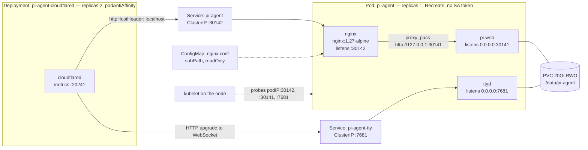
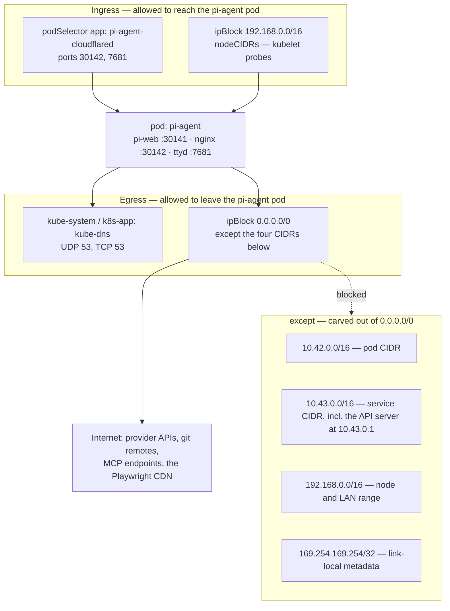
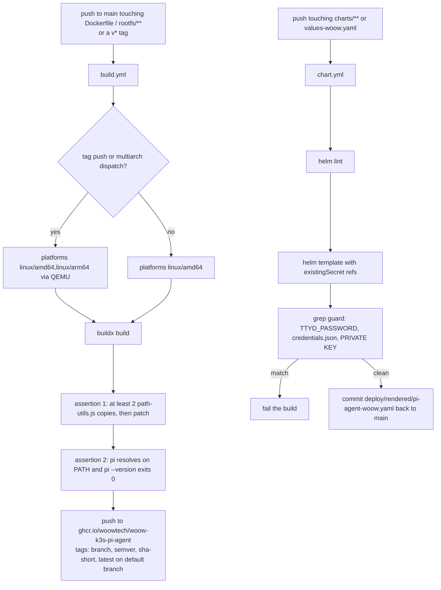

# Architecture

Engineering reference for the Woow k3s Pi Agent package. The README describes what the package does; this document describes how it is put together and why each part is shaped the way it is.

Everything below is derived from the sources in this repository — `Dockerfile`, `charts/pi-agent/`, `rootfs/`, `patches/`, and `.github/workflows/`. Behaviour that is not visible in those files is not described here.

**Contents**

| Section | Covers |
|---|---|
| [Container topology](#container-topology) | The three containers, their ports, the shared volume, and who talks to whom |
| [The trust guard](#the-trust-guard) | Why the nginx sidecar exists and what the tunnel cannot do for it |
| [Data layout on the volume](#data-layout-on-the-volume) | Every path the package creates or manages under `/data/pi-agent` |
| [Startup sequence](#startup-sequence) | `pi-web-start.sh`, step by step, including the skills bridge |
| [Network model](#network-model) | The NetworkPolicy: ingress, egress, and the DNS carve-out |
| [Build pipeline](#build-pipeline) | How the image and the rendered chart are produced |
| [The path-utils patch](#the-path-utils-patch) | The two upstream shapes and the exact semantic change to each |

---

## Container topology

One Deployment (`replicas: 1`, `strategy: Recreate`) holds three containers. A second Deployment holds the tunnel. Two ClusterIP Services connect them.



| Container | Image | Command | Listens on | Reached by | Mounts |
|---|---|---|---|---|---|
| `pi-web` | `ghcr.io/woowtech/woow-k3s-pi-agent` | `/usr/local/bin/pi-web-start.sh` | `0.0.0.0:30141` | nginx over loopback; kubelet at the pod IP | `data` at `/data/pi-agent` |
| `nginx` | `nginx:1.27-alpine` | image default | `:30142` | the `pi-agent` Service; kubelet at the pod IP | `nginx-conf` at `/etc/nginx/nginx.conf`, `subPath: nginx.conf`, read-only |
| `ttyd` | `ghcr.io/woowtech/woow-k3s-pi-agent` | `/usr/local/bin/ttyd-start.sh` | `0.0.0.0:7681` | the `pi-agent-tty` Service; kubelet at the pod IP | `data` at `/data/pi-agent` |

`ttyd` runs the same image as `pi-web` and mounts the same claim. That is the point of the sidecar rather than a separate deployment: a `pi config` run in the browser terminal edits the files the web UI is serving from, with no RBAC, no `kubectl exec`, and no second pod to race against during a restart. `ttyd-start.sh` refuses to `exec` at all when `TTYD_PASSWORD` is empty, so a misconfigured release fails closed instead of publishing an unauthenticated root shell.

### Why pi-web binds 0.0.0.0 but is not published

`pi-web-start.sh` defaults `PI_WEB_HOSTNAME` to `127.0.0.1`; the Deployment overrides it to `0.0.0.0`. The override exists for one reason: all three of pi-web's probes are `httpGet` on port `30141`, and the kubelet issues them from the node against the **pod IP**, not against loopback inside the container. A loopback-only bind answers nginx correctly and fails every probe, so the container would be restarted by the liveness check while serving traffic normally.

Binding all interfaces is not the same as publishing them. The `pi-agent` Service lists a single port — nginx's `30142` — so nothing in the cluster can reach pi-web by service name at all. Requests must enter through nginx, which is what makes the Host/Origin rewrite unavoidable rather than merely conventional.

What binding `0.0.0.0` does leave open is the pod IP itself: on a flat CNI, any pod in the cluster can dial `podIP:30141` and skip nginx entirely. pi-web's own request guard permits raw IPs, so it does not stop that. The NetworkPolicy does — its ingress rules admit only the cloudflared pods, and only on `30142` and `7681`. Port `30141` appears in no ingress rule; the sole reason the probes still work is the separate `nodeCIDRs` rule.

| Container | CPU request | CPU limit | Memory request | Memory limit |
|---|---|---|---|---|
| `pi-web` | 250m | 2 | 512Mi | 4Gi |
| `nginx` | 20m | 200m | 32Mi | 128Mi |
| `ttyd` | 50m | 500m | 64Mi | 512Mi |
| `cloudflared` | 50m | 500m | 64Mi | 256Mi |

| Probe | pi-web | nginx | ttyd |
|---|---|---|---|
| Startup | `GET /api/home` :30141, delay 10s, period 10s, threshold 30 | none | none |
| Readiness | `GET /api/home` :30141, period 10s, timeout 5s, threshold 3 | `GET /api/home` :30142, delay 15s, period 10s, timeout 5s, threshold 3 | TCP :7681, delay 5s, period 10s |
| Liveness | `GET /api/home` :30141, period 30s, timeout 10s, threshold 5 | none | TCP :7681, delay 30s, period 30s |

The startup probe carries the cold-volume case: 10 seconds of initial delay plus 30 attempts at 10-second intervals gives the process up to 310 seconds to answer before the kubelet gives up, and liveness does not begin evaluating until the startup probe has succeeded once. The alternative — a large `initialDelaySeconds` on liveness — would buy the same first-boot grace at the cost of leaving a wedged event loop undetected for that long on every subsequent restart.

`automountServiceAccountToken: false` is set on the pod spec. The pod makes no Kubernetes API calls, and it runs model-authored shell commands as uid 0, so a projected token would be reachable by anything the agent decides to `cat`.

---

## The trust guard

pi-web's `isApiRequestAllowed()` rejects any request whose `Host` header is not a loopback name or a raw IP, and any `Origin` that does not match it. Traffic arriving from the tunnel carries the public hostname in both. Without a rewrite, the static bundle loads and then every auth-gated route — models, skills, plugins, sessions — answers `403 Untrusted API request`, which presents as a UI that renders and does nothing.

The rewrite is two lines in `charts/pi-agent/templates/configmap-nginx.yaml`:

```nginx
# pi-web's isApiRequestAllowed() rejects any Host that is not a
# loopback name or raw IP, and any Origin that doesn't match it.
proxy_set_header Host localhost;
proxy_set_header Origin "";
```

The tunnel sets the first of those independently. `configmap-cloudflared.yaml` gives the web ingress rule `originRequest.httpHostHeader: localhost`, so the `Host` half of the guard is satisfied even before the request reaches the sidecar. Nothing in cloudflared blanks `Origin`. That asymmetry is the reason the sidecar cannot be simplified away: the tunnel covers `Host`, only nginx covers `Origin`, and the guard requires both. The `httpHostHeader` setting is belt-and-braces for the day someone removes the sidecar and expects the tunnel to carry the whole guard — it will carry exactly half of it.

Two further behaviours in the same `location` block are load-bearing:

| Directive | Value | Consequence if changed |
|---|---|---|
| `proxy_buffering` / `proxy_request_buffering` | `off` | Chat responses stream over SSE. With buffering on, long generations truncate at the proxy and the UI stops mid-sentence with no error. |
| `proxy_read_timeout` / `proxy_send_timeout` | `3600s` | A long tool-using turn holds the connection open; the nginx default would cut it. |
| `proxy_http_version` + `Upgrade`/`Connection` headers | `1.1`, mapped via `$http_upgrade` | WebSocket upgrades pass through rather than being answered as plain HTTP. |
| `client_max_body_size` | `100M` | Bounds the request body. This is the only input bound in the path; the model-side token cost of a large paste is not bounded here. |

nginx adds no authentication of its own. `Host: localhost` is a compatibility shim for an upstream trust check, not an access control — pi-web accepts raw IPs too, so anything that can route to the pod IP bypasses it. Access control in this package is the Cloudflare Access policy in front of both hostnames plus the NetworkPolicy behind them.

Scratch paths are pinned into `/tmp` (`client_body_temp_path`, `proxy_temp_path`, and the three FastCGI/uwsgi/SCGI equivalents) and `pid /tmp/nginx.pid`, so the sidecar never needs a writable `/var/cache`. The Deployment carries `checksum/nginx` computed over the rendered ConfigMap, so editing the proxy config rolls the pod instead of sitting inert until an unrelated restart.

---

## Data layout on the volume

One `ReadWriteOnce` claim, 20Gi by default, `storageClassName: nfs-data`, annotated `helm.sh/resource-policy: keep` so `helm uninstall` does not take a month of sessions with it. It is mounted at `/data/pi-agent` in both `pi-web` and `ttyd`.

`pi-agent-env.sh` is what makes the volume authoritative: it exports `PI_CODING_AGENT_DIR=/data/pi-agent` and `HOME=/data/pi-agent/home`. Unset, both would default under the container's ephemeral root filesystem and every session, skill and credential would vanish on restart. The same file is sourced by `pi-web-start.sh`, `pi-shell.sh`, the `pi` wrapper and `/etc/profile.d`, so an interactive `kubectl exec ... -- bash -l` lands in the environment the server runs in — divergence there is how "works in the UI, not in the terminal" bugs are made.

| Path | Written by | Losing it costs |
|---|---|---|
| `sessions/` | pi-web, one JSONL per session. Created by `pi-web-start.sh` on every boot. | All conversation history and the only forensic record of what the agent did. Not recoverable. |
| `skills/` | The operator, the `skills` CLI and `pi install`, via the `$HOME/.pi/agent/skills` symlink. Read by pi-web and injected into every session's system prompt. | Every installed skill. Re-installable if the sources are elsewhere. |
| `home/` | `HOME` for pi-web, ttyd and every agent subprocess. The agent creates per-session worktrees `pi-cwd-*` here. | All work product the agent produced that was not pushed to a git remote. |
| `models.json` | pi-web's Models page. Holds the provider catalogue **and the provider API key in plaintext**. `chmod 600` on every boot. | Provider config; the key must be re-entered. Treat a copy of this file as a leaked key. |
| `models-store.json` | pi-web. `chmod 600` on every boot alongside `models.json`. | Provider selection state. |
| `auth.json` | pi-web / `pi auth`. `chmod 600` on every boot. | Stored provider credentials. |
| `settings.json` | `pi install` and `pi config` register packages here; the web UI reads the same file. | The plugin/extension registration list. |
| `venv/` | `video-tools-init.sh` — Python venv with playwright, edge-tts, pyyaml, mutagen. `PATH` is prepended to it only when `venv/bin/python3` is executable. | Nothing permanent. Re-created on next boot at the cost of part of a ~720 MB download. |
| `playwright-cache/` | `video-tools-init.sh`, via `PLAYWRIGHT_BROWSERS_PATH`. Chromium, roughly 600 MB of the total. | Nothing permanent; re-downloaded. |
| `projects/` | Created by `video-tools-init.sh`; working area for the video pipeline. | Video project working files. |
| `rclone/rclone.conf` | `rclone config`, run by hand from the browser terminal. Referenced by `RCLONE_CONFIG`. `chmod 600` on every boot. | The Drive upload target and its OAuth tokens. Re-authorisation required. |
| `.video-tools-installed` | `video-tools-init.sh` on success. Sentinel; later boots see it and exit in milliseconds. | Only a repeat of the ~720 MB install. |

The table covers the paths this package creates, chmods or bridges. pi-web maintains further state of its own under the same root at runtime; nothing in this repository reads or writes it.

Two consequences follow from a single RWO claim holding all of that. The first is `replicas: 1` with `strategy: Recreate`: two pods would double-write every file listed above, and a rolling update cannot attach the volume until the outgoing pod releases it — so horizontal scale is a correctness constraint, not an untuned default. The second is that the `ttyd` root shell and the agent's own `read` tool both see the credential rows in this table. The boot-time `chmod 600` narrows the file mode; it does nothing about either of those paths, and `pi-web-start.sh` says so in a comment rather than implying otherwise.

---

## Startup sequence

```mermaid
sequenceDiagram
    autonumber
    participant K as kubelet
    participant S as pi-web-start.sh
    participant E as pi-agent-env.sh
    participant V as PVC /data/pi-agent
    participant B as video-tools-init.sh
    participant P as pi-web process

    K->>S: exec via tini, PID 1 reaping
    S->>S: set -euo pipefail; exec 2>&1
    S->>E: source
    E-->>S: PI_CODING_AGENT_DIR, HOME, PLAYWRIGHT_BROWSERS_PATH, RCLONE_CONFIG
    S->>V: mkdir -p sessions/ home/ skills/ rclone/
    S->>V: chmod 600 models.json, models-store.json, auth.json, rclone/rclone.conf

    rect rgb(240,240,240)
    Note over S,V: skills path bridge
    S->>V: is $HOME/.pi/agent/skills a real dir?
    alt real dir, not a symlink
        S->>V: cp -an into /data/pi-agent/skills, then rm -rf the original
    end
    S->>V: ln -sfn /data/pi-agent/skills $HOME/.pi/agent/skills
    end

    opt RESET_VIDEO_TOOLS=true
        S->>V: rm -rf sentinel, venv/, playwright-cache/
    end
    opt TZ set and present in /usr/share/zoneinfo
        S->>S: symlink /etc/localtime, write /etc/timezone
    end

    opt VIDEO_PIPELINE_ENABLED=true
        S-)B: launch in background, no wait
        B->>V: sentinel present and venv usable? exit 0
        B->>V: python3 -m venv, pip install, playwright install chromium
        B->>V: touch .video-tools-installed
    end

    S->>P: exec pi-web from $HOME
    K->>P: startupProbe GET /api/home, up to 310s
    K->>P: readiness + liveness once startup succeeds
```

### The skills path bridge

pi-web reads skills from `${PI_CODING_AGENT_DIR}/skills`. The `skills` CLI and `pi install` write to the agent's own home, `$HOME/.pi/agent/skills`. On the Home Assistant add-on those two resolve to the same directory; here they do not, because `HOME` is pinned to `/data/pi-agent/home` while `PI_CODING_AGENT_DIR` is `/data/pi-agent`. The failure that produces is quiet and confusing: `pi install` reports success from the browser terminal, and the skill never appears in any session.

The bridge is three steps in `pi-web-start.sh`, in this order, on every boot:

1. If `$HOME/.pi/agent/skills` exists as a real directory rather than a symlink, `cp -an` its contents into `/data/pi-agent/skills` and remove the original. `-n` means an existing file on the volume side wins; nothing already visible to pi-web is overwritten by a migration.
2. If the path does not exist at all, `ln -sfn` it to `/data/pi-agent/skills`.
3. Log which of the two happened, so a support engineer reading `kubectl logs` can tell a migration from a plain link.

Because step 1 runs before step 2 and both are idempotent, a pod that has already been bridged does no filesystem work beyond one `stat`.

### Why the video bootstrap is backgrounded

`video-tools-init.sh` is launched with `&` and never waited on. It is not an initContainer, and that is deliberate.

The first run on a cold volume pulls roughly 720 MB: a Python venv with playwright, edge-tts, pyyaml and mutagen, then Chromium at around 600 MB of that. As a blocking initContainer, that download sits in front of the pi-web container — the pod serves nothing for 10 to 20 minutes on first boot, and any interruption in the download produces a pod that never becomes ready at all. Chat, skills, sessions and git need none of it.

The script is written to survive being fired and forgotten. It runs `set -uo pipefail` without `-e`, and every failure path logs a warning and exits 0: a failed `venv` creation, a failed `pip install` and a failed Chromium download each disable one capability and leave pi-web serving. It is idempotent, guarded by `.video-tools-installed` on the PVC together with an executable check on `venv/bin/python3`, so subsequent boots exit in milliseconds. And it installs into the PVC rather than the image layer, so an image bump does not re-download anything.

The escape hatch for a half-written venv — the failure mode NFS makes likely — is `videoPipeline.reset: true`, which clears the sentinel, `venv/` and `playwright-cache/` on the next boot. It is a one-shot: left `true`, every restart re-downloads the full 720 MB, and the start script logs exactly that warning when it fires.

---

## Network model

`networkPolicy.enabled` defaults to `true`. The policy selects the pi-agent pod and declares both `Ingress` and `Egress`, which makes everything not explicitly matched denied.



**Ingress.** Two rules. The first admits pods labelled `app: <fullname>-cloudflared` on the nginx port and the ttyd port. Note what is missing: `30141` appears in no ingress rule, so pi-web's own port is unreachable even from the tunnel — every request goes through the sidecar. The second admits `192.168.0.0/16` with no port restriction, which is the node network. Kubelet probes originate from the node rather than from a pod, and some CNIs subject them to NetworkPolicy; a blocked liveness probe is not a blocked request, it is a killed container, so this rule is what keeps the pod alive. It is also the widest rule in the policy — anything on the LAN that can route to the pod IP is admitted by it, including on `30141`.

The ingress restriction has a specific target. `GET /api/models-config` returns the provider API key unredacted and unauthenticated, and pi-web's Host guard permits raw IPs, so the nginx sidecar is no obstacle to a pod that dials the pod IP directly. In a cluster that also hosts unrelated production namespaces, this policy is the only thing standing in that path.

**Egress.** The agent's job is to reach arbitrary external endpoints — provider APIs, git remotes, MCP servers, the Playwright CDN — so the policy allows `0.0.0.0/0` and carves the cluster out of it with an `except` list rather than trying to enumerate an allowlist. The four exclusions come from `values.yaml`:

| CIDR | What it is | Why it is excluded |
|---|---|---|
| `10.42.0.0/16` | k3s pod CIDR | Every other pod in the cluster, in every namespace |
| `10.43.0.0/16` | k3s service CIDR | Includes the Kubernetes API server at `10.43.0.1:443`, plus kube-system's metrics-server and traefik |
| `192.168.0.0/16` | node and LAN range | The nodes themselves and everything else on the office network |
| `169.254.169.254/32` | link-local metadata address | Cloud instance metadata, a standard credential-theft target |

All three of the first row's targets were confirmed reachable before this policy existed: the API server answered `401` — blocked only by the absent ServiceAccount token, not by the network — and kube-system services and sibling namespaces answered normally. Nothing the agent legitimately does requires any of them.

**Why DNS needs its own rule.** kube-dns is reached at a ClusterIP inside `10.43.0.0/16`, and its pods live inside `10.42.0.0/16`. Both ranges are in the `except` list of the broad egress rule, so that rule cannot carry DNS no matter how it is written — an `ipBlock` `except` is a hole in that rule, not a global deny, but there is no other rule that would cover the missing range. The policy therefore adds a separate egress rule selecting `namespaceSelector: kubernetes.io/metadata.name: kube-system` with `podSelector: k8s-app: kube-dns` on UDP and TCP 53. Selector-based rules match pod identity rather than address, so they are unaffected by the CIDR carve-out. Without this rule the pod resolves nothing, which presents as every outbound call failing rather than as a policy error.

`blockedCIDRs` and `nodeCIDRs` are both values, and both are cluster-specific. A cluster with different ranges needs them changed — `kubectl cluster-info dump | grep -m1 cluster-cidr` reports the first two.

---

## Build pipeline

Two workflows, two artefacts, no manual step between source and registry.



The image is a single-stage `debian:bookworm-slim` build. There is no s6-overlay and no bashio: on Kubernetes the kubelet is the supervisor and one process per container is the whole point, and configuration arrives as env from the chart rather than from a Supervisor `options.json`. `tini` is the entrypoint purely for PID 1 reaping — ttyd forks a shell per browser session, and without an init that reaps, every closed tab leaves a zombie.

Three things are pinned rather than floating. `PI_WEB_VERSION=0.8.4` is the version the add-on validated end to end, and it is what the nginx sidecar's Host/Origin rewrite and the `/api/*` route surface are written against. `TTYD_VERSION=1.7.7` is fetched from the upstream release and checksum-verified against that release's own `SHA256SUMS`, with the build failing on either a missing expected hash or a mismatch, then sanity-checked with `ttyd --version`. `cloudflare.image` is a dated tag, not `:latest`, because `:latest` with `imagePullPolicy: IfNotPresent` means the tunnel daemon silently upgrades itself the first time a pod lands on a node without the layer cached.

Baking rather than downloading at runtime is the other standing rule: an earlier k3s deploy fetched ttyd and kubectl from GitHub on every container start, which made pod startup depend on github.com and on apt mirrors being healthy.

### The two build-time assertions

**Assertion 1 — the patch target still exists.** Before applying the CJK path fix, the Dockerfile enumerates matches for `*@earendil-works/*/dist/*/tools/path-utils.js` under the installed pi-web tree and fails if fewer than two are found:

```
if [ "${#FILES[@]}" -lt 2 ]; then
  echo "[patch] FAIL: expected at least 2 copies, found ${#FILES[@]}" >&2
  echo "[patch] upstream layout changed — re-verify before shipping" >&2
  exit 1
fi
```

Without it, a pi-web bump that moves or renames those files makes `find` match nothing, the patch step becomes a no-op, and the image ships looking identical while having quietly lost a data-corruption fix. The assertion converts that into a red build. The patch script enforces the same principle one level down: an unrecognised file shape or a hunk that does not match exits non-zero rather than skipping the file.

**Assertion 2 — `pi` actually runs.** After `rootfs/` is copied and the launcher scripts are made executable, the build runs `test -x "$(command -v pi)"` followed by `pi --version`. `@earendil-works/pi-coding-agent` declares `bin.pi` but is only ever installed as a transitive dependency of `@agegr/pi-web`, and npm does not link bins of transitive dependencies — so the CLI ships inside the image with no entry on `PATH`. Every terminal workflow depends on the `rootfs` wrapper resolving it: `pi config`, `pi auth`, `pi install`, and driving the TUI at all. The wrapper resolves the nested path at runtime, across four candidate locations plus a `find` fallback, precisely because a pi-web bump can move it; the assertion proves that resolution still works in the image being published rather than in the one that was tested months earlier.

### Chart CI

`chart.yml` lints the chart, renders it with `ttyd.existingSecret` and `cloudflare.existingCredentialsSecret` set so no credential can appear in the output, then greps the rendered manifest for `TTYD_PASSWORD: `, an inline `credentials.json: {`, and PEM private-key headers. A match fails the job before anything is committed. Only after that guard passes does the workflow commit `deploy/rendered/pi-agent-woow.yaml` back to `main`, which keeps the chart the single source of truth while still giving reviewers a diffable rendered manifest.

Two details worth knowing when reading a published image. `BUILD_DATE` is declared as an `ARG` and surfaced in `org.opencontainers.image.created`, but `build.yml` passes only `BUILD_VERSION` and `BUILD_REF` — so that label carries its default, `unknown`. And `provenance: false` is set on the build step, so images do not carry a SLSA attestation; `org.opencontainers.image.revision` from `BUILD_REF` is the link back to the source commit.

---

## The path-utils patch

`patches/fix-unicode-space-paths.mjs` runs at build time against the compiled tool layer inside `node_modules`. Patching compiled upstream output is not a light decision; the alternative was shipping known silent data corruption to a zh-TW deployment while waiting on upstream.

### What upstream does

Both implementations fold `U+00A0`, `U+2000`–`U+200A`, `U+202F`, `U+205F` and `U+3000` to an ASCII space on **every** read, write and edit, and both build the read fallback chain from the already-folded path — so the exact path the caller asked for is never tried. `U+3000 IDEOGRAPHIC SPACE` is ordinary in Traditional Chinese and Japanese filenames, so this is a default case, not an edge case.

| Symptom | Mechanism |
|---|---|
| A write lands at a path nobody asked for | `write` resolves through the folding path but builds its success message from the original argument: `Successfully wrote 10 bytes to 新建　檔案.txt` against a file that does not exist |
| A read of an existing file returns `ENOENT` | `台灣<U+3000>報告.txt` folds to `台灣<U+0020>報告.txt`, which is a different file |
| A read returns a **different file's** contents | With `Q1<U+3000>報告.txt` and `Q1<U+0020>報告.txt` both present, reading the first returns the second, `isError: false`, and the agent reports it as the file that was requested |

The third row is the reason this is a patch rather than a bug report: a confidential/public pair differing only by space type cross-reads, and the same mechanism makes a write silently clobber the sibling.

### Shape A — `@earendil-works/pi-agent-core/dist/harness/tools/path-utils.js`

Detected by the presence of `function normalizeToolPath(path) {` together with `UNICODE_SPACES`.

| Before | After |
|---|---|
| `normalizeToolPath` calls `path.replace(UNICODE_SPACES, " ")` and returns the folded string, after stripping a leading `@` | `normalizeToolPath` strips the leading `@` and returns the path **unchanged**. Folding moves into a new `foldUnicodeSpacesForRead` helper. |
| The read variant list starts with `resolved` and continues to the other heuristics | The folded form is inserted as the second entry, immediately after `resolved` |

The `@` strip is kept. It is a deliberate UX affordance for pasted mentions, not a silent rewrite of a filename.

### Shape B — `@earendil-works/pi-coding-agent/dist/core/tools/path-utils.js`

Detected by `export function resolveToCwd(filePath, cwd) {` together with `normalizeUnicodeSpaces: true`. Four hunks.

| Function | Before | After |
|---|---|---|
| `expandPath` | `normalizePath(filePath, { normalizeUnicodeSpaces: true, ... })` | `normalizeUnicodeSpaces: false`; folding moves to a new `tryUnicodeSpaceFold` helper used only on the read path |
| `resolveToCwd` | `resolvePath(filePath, cwd, { normalizeUnicodeSpaces: true, ... })` | `normalizeUnicodeSpaces: false`. Writes and edits resolve through this function, so this is the hunk that stops a write from ever landing at a rewritten path |
| Sync read resolution | Exact path, then the macOS AM/PM narrow-no-break-space variant | Exact path, then the folded variant guarded by `fileExists`, then the AM/PM variant |
| Async read resolution | Same chain, `await pathExists` | Same insertion, `await pathExists` |

Both read chains are patched because the sync and async resolvers are separate code paths; patching one would leave the fix depending on which caller reached the file.

### Net semantics

| Operation | Before | After |
|---|---|---|
| `write` / `edit` to a path containing a Unicode space | Lands at the folded path; success message quotes the original path | Lands at exactly the requested path, or fails visibly |
| `read` of an exact path that exists | May be shadowed by a folded sibling | Returns that file |
| `read` of a path whose folded form exists but whose exact form does not | Returns the folded file, indistinguishably | Returns the folded file — still supported, but only after the exact path has missed |
| Two files differing only by space type | Either can silently return the other | Each resolves to itself |

Folding survives as a read-only fallback on purpose: pasting a path with a non-breaking space out of a web page or a PDF is common, and that case should still resolve. What changes is precedence — the exact path is tried first, always — and that writes are never rewritten at all.

The script is idempotent: it marks each file it edits with `PATCHED (Woow k3s image)` and skips anything already carrying the mark, and it exits non-zero if it patched nothing and found nothing already patched, so a silent no-op is not a possible outcome.

---

## See also

| Document | Covers |
|---|---|
| [`README.md`](../README.md) | Installation, configuration, screenshots, known limitations |
| [`docs/READINESS.md`](READINESS.md) | The commercial-readiness assessment: blockers, accepted limitations, runbook gaps |
| [`charts/pi-agent/values.yaml`](../charts/pi-agent/values.yaml) | Every chart value, with the rationale inline |
| [`patches/fix-unicode-space-paths.mjs`](../patches/fix-unicode-space-paths.mjs) | The patch source and its full rationale header |
